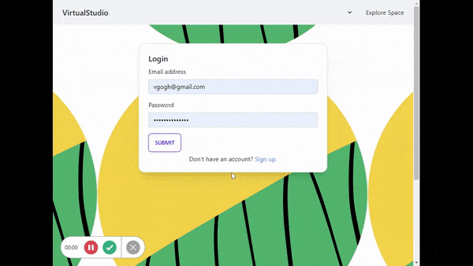
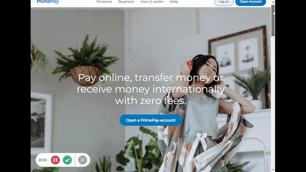
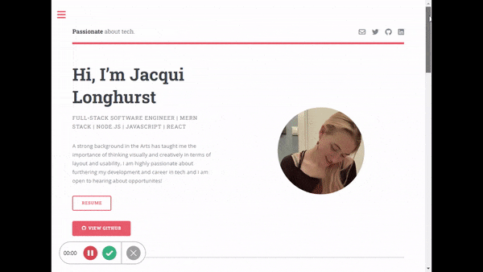
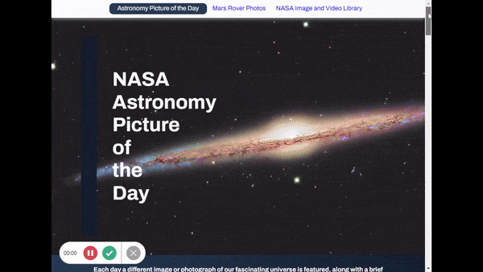
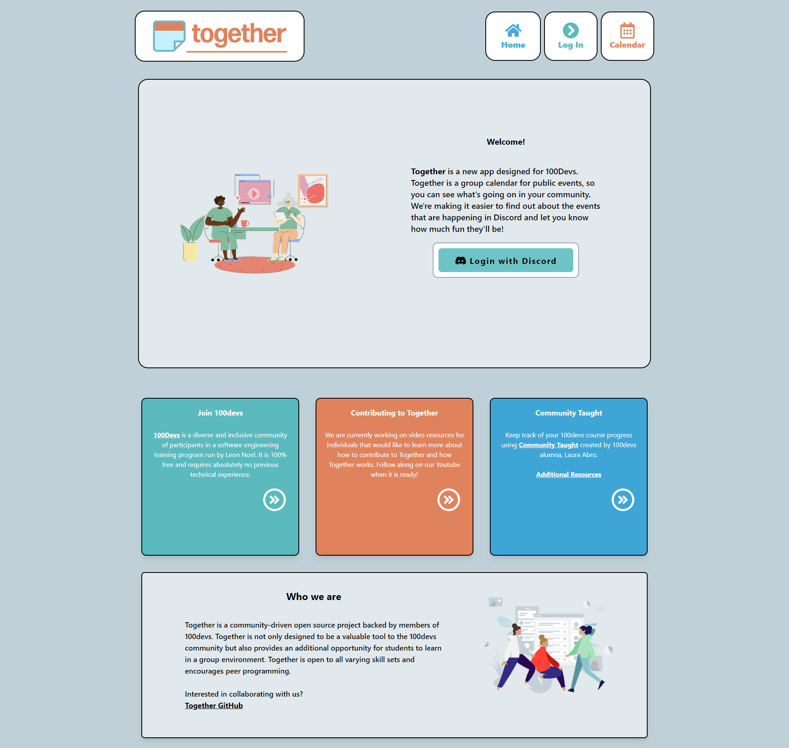

### Hi there 👋

<!--
**jalonghurst/jalonghurst** is a ✨ _special_ ✨ repository because its `README.md` (this file) appears on your GitHub profile.

Here are some ideas to get you started:

- 🌱 I’m currently learning ...
- 👯 I’m looking to collaborate on ...
- 🤔 I’m looking for help with ...
- 😄 Pronouns: ...
-->

⚡ I'm a Software Engineer and web developer currently working with the MERN stack.
 
⚛ I’m currently working on 'VirtualStudio'. VirtualStudio is a virtual gallery space that allows artists and creatives to showcase their work in an online, accessible format.

💬 Avaliable to work: Fullstack Developer | MERN stack | JavaScript | Node.js | Express.js | React

📫 How to reach me: jacqui.longhurst@btinternet.com 

#### Languages

#### Technologies

###### Build Tools: Task Runners / Module Bundlers / Linters and Formatters

###### CSS Frameworks 

###### JavaScript Runtimes and Libraries 

###### Version Control Systems / Repo Hosting Services / Package Managers

<!--  -->

<h1 align="center">Projects</h1>
<table bordercolor="#66b2b2">
  
  <tr>
    <td width="50%" valign="top">
      <h3 align="center">Virtual Studio</h3>
         
        
         
        

          
    
  
      

        
<strong>MVC: Javascript, MongoDB, DaisyUI/Tailwind, Node.js, & Express.js</strong> - VirtualStudio is a virtual gallery space that allows artists and creatives to showcase their work in an online, accessible format.

    </td>
    <td width="50%" valign="top">
      <h3 align="center">PrimePay</h3>
         
      
         
        

          
  
  
      

        
<strong>Javascript, HTML5 & CSS</strong> - A responsive web layout for a payment provider, online banking/financial service.

    </td>
  </tr>
  
  <tr>
    <td width="50%" valign="top">
      <h3 align="center">JacquiLonghurst.com</h3>
       
        
       
        

  
  
      

        
<strong>HTML5, CSS3, & Javascript</strong> - Portfolio Site including links to my projects and ways to get in contact with me.

    </td>
    <td width="50%" valign="top">
      <h3 align="center">NASA Space Data App</h3>
         
        
         
        

          
  
  
      

        
<strong>HTML5, CSS3, & Javascript</strong> - A web app which fetches and displays space data from various NASA sourced APIs.

    </td>
  </tr>
   
  <tr>
    <td width="50%" valign="top">
      <h3 align="center">Group Project</h3>
       
        
       
        

  
  
      

        
<strong>React.js, Tailwind.css, Node.js, Express.js, JavaScript, MongoDB </strong> - Together is a group calendar application using the MERN stack intended to bring discord communities closer!

    </td>
    <td width="50%" valign="top">
      <h3 align="center">Together: Latest open source contribution</h3>
         
        
         
        

          
  
  
      

        
<strong>React.js, Tailwind.css, Node.js, Express.js, JavaScript, MongoDB, strong> -Together is a group calendar application using the MERN stack intended to bring discord communities closer!

    </td>
  </tr>
</table>

